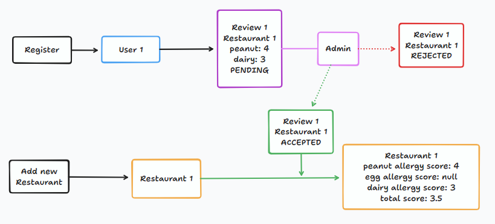

# java-dining-review-api :curry:

## :page_facing_up: Description

This project is the final project of the [Codecademy](https://codecademy.com) course
*Create REST APIs with Spring and Java*. The Dining Review API allows users to create accounts,
add restaurants, and submit reviews focused on how well the restaurants accommodate dairy,
peanut, and egg allergies. Users can provide feedback on restaurants' allergy-friendly practices,
while admins have the authority to accept or reject these reviews.

## :arrow_forward: Getting Started

To manage the project's build I've used **Maven**.

* To run the application: `./mvnw spring-boot:run`
* To run the automatic tests: `./mvnw test`
* To create the jar file, run: `./mvnw package`

## :factory: Business

Here is a basic diagram of how the API works. Right now, both registered and unregistered users
can add new restaurants.


## :woman_technologist: Tech Stack

The dining review app is built using Java and Spring Boot framework.

**Additional libraries**:

- **Lombok**: to reduce boilerplate code by using annotations.
- **JUnit**: to write and run tests.
- **Mockito**: to create mock objects in unit tests to isolate the behavior of the class being tested from its
  dependencies.
- **AssertJ**: to make the tests more readable by writing assertions that resemble natural language.
- **H2Database**: to set up an H2 database.

## :test_tube: Api Endpoints
Here there are some instructions to test all the endpoints. Remember to run the application first.
<details>
<summary> :bust_in_silhouette: User endpoints</summary>

1. Create new user

#### POST /users
```
curl -X POST -d "{\"username\":\"mariaPadilla\", \"city\":\"Phoenix\", \"state\":\"Arizona\", \"zipcode\":\"85007\", \"peanut\":false, \"egg\":false, \"dairy\":true}" -H "Content-Type: application/json" http://localhost:8080/users
```

2. Get user by username
#### GET /users/{username}
```
curl http://localhost:8080/users/mariaPadilla
```

3. Update user
#### PUT /users/{username}
```
curl -X PUT -d "{\"city\":\"Los Angeles\", \"state\":\"California\", \"zipcode\":\"90240\", \"peanut\":true, \"egg\":false, \"dairy\":true}" -H "Content-Type: application/json" http://localhost:8080/users/mariaPadilla
```

</details>

<details>
<summary>:fork_and_knife: Restaurant endpoints</summary>

1. Create new restaurant
#### POST /restaurants
```
curl -X POST -d "{\"name\":\"Es Brollador\", \"zipcode\":\"85007\"}" -H "Content-Type: application/json" http://localhost:8080/restaurants
```
2. Search restaurant by id
#### GET /restaurants/{restaurantId}
```
curl http://localhost:8080/restaurants/1
```
3. Search restaurants with query params
#### GET /restaurants?zipcode={zipcode}&allergy={allergy}
Both query params are not required, so we can also find all restaurants available.
```
curl http://localhost:8080/restaurants
```
```
curl http://localhost:8080/restaurants?zipcode=85007
```
> :memo: **Note:** If you have run these cURLs in order, the next one will return an empty list because the restaurant 
> hasn't been reviewed yet.
```
curl http://localhost:8080/restaurants?allergy=peanut
```
```
curl http://localhost:8080/restaurants?zipcode=85007&allergy=egg
```
</details>

<details>
<summary>:100: Review endpoints</summary>

1. Create a review
#### POST /{username}/{restaurantId}/reviews
```
curl -X POST -d "{\"peanutScore\": 4, \"dairyScore\": 4, \"commentary\":\"Nice place\"}" -H "Content-Type: application/json" http://localhost:8080/mariaPadilla/1/reviews
```
2. (Admin) Search all pending reviews
#### GET /admin/pending
```
curl http://localhost:8080/admin/pending
```
3. (Admin) Accept a review
#### PUT /admin/{reviewId}/accept
```
curl -X PUT http://localhost:8080/admin/1/accept
```
4. (Admin) Reject a review
#### PUT /admin/{reviewId}/reject
```
curl -X PUT http://localhost:8080/admin/1/reject
```
</details>